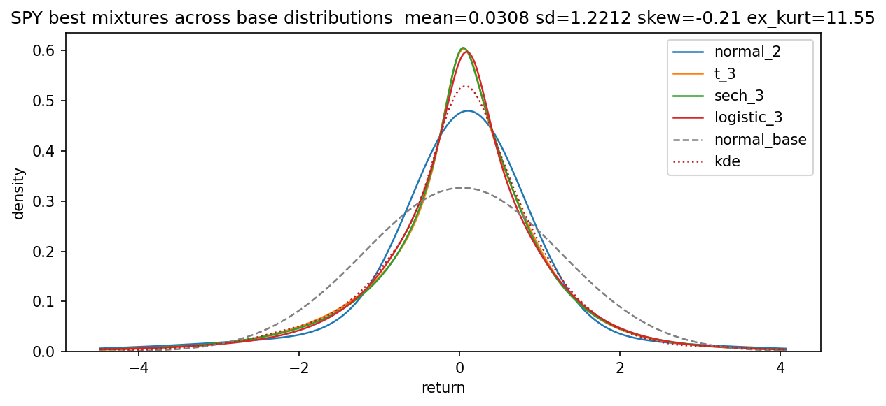
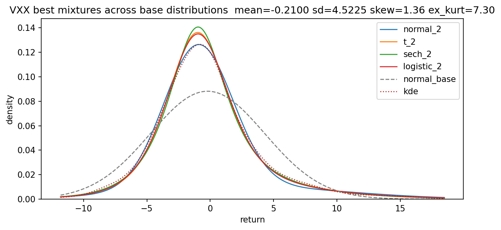

Return-Mixtures
===============

Fit univariate and multivariate mixture models to return series with multiple base distributions.
The main entry point is `xreturns_mix_general.py`. [Return-Mixtures-of-Normals](https://github.com/vivek-v-rao/Return-Mixtures-of-Normals)
is a simpler project that only fits mixtures of normals.

Overview
--------
- Reads a price file (CSV or Parquet), computes returns, and fits mixtures by symbol.
- Supports base distributions: normal, Student t (`t`), hyperbolic secant (`sech`), and logistic.
- Optionally fits multivariate mixtures when `k_mv_max > 0` and the family is `normal` or `t`.
- Produces summary tables, parameter tables, information criteria, and density plots.

Quick Start
-----------
```bash
python xreturns_mix_general.py
```

Dependencies
------------
Python 3.10+ with:
- `numpy`
- `pandas`
- `matplotlib`
- `scipy` (required for `t`, `sech`, and `logistic` mixtures)
- `scikit-learn` (Gaussian mixtures for normal/multivariate normal)

Files Used by `xreturns_mix_general.py`
---------------------------------------
- `xreturns_mix_general.py` (main script)
- `stats.py` (price/return helpers)
- `mixture.py` (Gaussian mixture helpers + multivariate t mixture)
- `mix_fit.py` (EM fitters for sech/logistic/t)
- `mix_dist.py` (pdf/log-pdf helpers)
- `mix_moments.py` (mixture moments)
- `mix_em.py` (numerical utilities)
- `mix_select.py` (model selection helpers)

Inputs
------
- Default input: `etfs_adj_close.csv` (set `in_prices_file` in `main()` to change).
- CSV should have a date index in the first column and one column per symbol.
- Parquet is also supported.

Configuration (in `main()`)
---------------------------
Key options you can edit in `xreturns_mix_general.py`:
- `in_prices_file`, `ret_scale`, `use_log_returns`, `date_min`, `date_max`
- `dist_families` (e.g., `["normal", "t", "sech", "logistic"]`)
- `k_max` (max univariate components)
- `k_mv_max` (max multivariate components)
- `t_dof` (fixed dof for univariate t; set `None` to estimate)
- `t_dof_mv` (fixed dof for multivariate t; defaults to `t_dof`)
- Plot toggles: `show_density_plot`, `show_best_density_plot`, `create_all_best_density_plot`

Notes on Student t
------------------
- If `t_dof` is set (fixed), dof is not counted as a free parameter in AIC/BIC.
- If `t_dof` is `None`, dof is estimated per component in the univariate t mixture.
- Multivariate t uses a fixed dof (`t_dof_mv`).

Outputs
-------
Console output includes:
- Model selection tables (AIC/BIC by k)
- Parameter tables
- Moment tables
- Univariate and multivariate summary comparisons

Plots (when enabled):
- Per-family best density: `<symbol>_<family>_density.png`
- Cross-family best plot: `<symbol>_all.png`
- Each plot includes KDE and a normal reference density.

Limitations
-----------
- Multivariate t mixture uses a fixed dof; estimating dof is not implemented.

Sample Output
-------------
```
prices file: etfs_adj_close.csv
#obs, symbols, columns: 6553 8 8
return_type: log
ret_scale: 100.0
ewma_lambda: NULL
base distributions: normal, t, sech, logistic
max # of mixture components: 3
max # of mv mixture components: 2
#obs, first, last: 6553 2000-01-03 2026-01-22

base distribution: normal

multivariate fit: n=2008 d=8
model selection over k=1..2 (aic, bic)
k= 1  aic=   46820.311  bic=   47066.926
k= 2  aic=   41894.844  bic=   42393.679
bic selects k=2
aic selects k=2

weights, means, stds per component (sorted by descending weight)
                  weight  mean_SPY  mean_TLT  mean_VXX  mean_LQD  mean_HYG  mean_UNG  mean_GLD  mean_SLV  sd_SPY  sd_TLT  sd_VXX  sd_LQD  sd_HYG  sd_UNG  sd_GLD  sd_SLV
label  component                                                                                                                                                        
fit_k2 1          0.8622    0.1037   -0.0163   -0.5549    0.0125    0.0320   -0.0859    0.0737    0.1085  0.8031  0.8262  3.3428  0.4103  0.3151  3.3514  0.8008  1.5100
       2          0.1378   -0.2815    0.0563    1.9484   -0.0070   -0.0753   -0.1965   -0.0048   -0.0734  2.6105  1.6926  8.5508  1.2199  1.2797  4.9363  1.6428  3.3244

correlations per component (stacked blocks)
                          SPY    TLT    VXX    LQD    HYG    UNG    GLD    SLV
label  component var_i                                                        
fit_k2 1         SPY    1.000 -0.056 -0.763  0.222  0.699  0.058  0.053  0.168
                 TLT   -0.056  1.000  0.096  0.872  0.277 -0.048  0.281  0.135
                 VXX   -0.763  0.096  1.000 -0.127 -0.545 -0.038 -0.009 -0.118
                 LQD    0.222  0.872 -0.127  1.000  0.572 -0.030  0.319  0.214
                 HYG    0.699  0.277 -0.545  0.572  1.000  0.031  0.182  0.208
                 UNG    0.058 -0.048 -0.038 -0.030  0.031  1.000 -0.002  0.006
                 GLD    0.053  0.281 -0.009  0.319  0.182 -0.002  1.000  0.759
                 SLV    0.168  0.135 -0.118  0.214  0.208  0.006  0.759  1.000
       2         SPY    1.000 -0.240 -0.750  0.390  0.830  0.180  0.131  0.321
                 TLT   -0.240  1.000  0.171  0.507 -0.062  0.003  0.202  0.070
                 VXX   -0.750  0.171  1.000 -0.278 -0.556 -0.132 -0.045 -0.247
                 LQD    0.390  0.507 -0.278  1.000  0.603  0.092  0.298  0.277
                 HYG    0.830 -0.062 -0.556  0.603  1.000  0.122  0.207  0.335
                 UNG    0.180  0.003 -0.132  0.092  0.122  1.000  0.077  0.071
                 GLD    0.131  0.202 -0.045  0.298  0.207  0.077  1.000  0.758
                 SLV    0.321  0.070 -0.247  0.277  0.335  0.071  0.758  1.000

symbol=SPY  n=6552
model selection over k=1..3 (aic, bic)
k= 1  aic=   21215.894  bic=   21229.469
k= 2  aic=   19442.795  bic=   19476.732
k= 3  aic=   19488.359  bic=   19542.659
bic selects k=2
aic selects k=2

SPY best-fit parameters (bic)
                      weight    mean      sd
label      component                        
SPY_fit_k2 1          0.7850  0.1071  0.7081
           2          0.2150 -0.2478  2.2375

SPY 6552 returns from 2000-01-04 to 2026-01-22
SPY selected k (aic, bic): 2, 2
SPY moments (mean, sd, skew, excess kurtosis)
             mean      sd    skew  ex_kurt      loglik         aic         bic
label                                                                         
empirical  0.0308  1.2212 -0.2099  11.5455         NaN         NaN         NaN
fit_k1     0.0308  1.2212  0.0000   0.0000 -10605.9472  21215.8944  21229.4695
fit_k2     0.0308  1.2212 -0.4469   4.7684  -9716.3974  19442.7947  19476.7324
fit_k3     0.0308  1.2212 -0.3185   3.5960  -9736.1796  19488.3592  19542.6594

SPY fit_k2 parameters
                      weight    mean      sd
label      component                        
SPY_fit_k2 1          0.7850  0.1071  0.7081
           2          0.2150 -0.2478  2.2375

SPY fit_k3 parameters
                      weight    mean      sd
label      component                        
SPY_fit_k3 1          0.6981  0.1181  0.6282
           2          0.1581  0.5251  1.8868
           3          0.1438 -0.9366  1.8161

symbol=TLT  n=5908
model selection over k=1..3 (aic, bic)
k= 1  aic=   15589.645  bic=   15603.013
k= 2  aic=   15253.159  bic=   15286.579
k= 3  aic=   15305.111  bic=   15358.584
bic selects k=2
aic selects k=2

TLT best-fit parameters (bic)
                      weight    mean      sd
label      component                        
TLT_fit_k2 1          0.6330  0.0743  0.6349
           2          0.3670 -0.0880  1.2326

TLT 5908 returns from 2002-07-31 to 2026-01-22
TLT selected k (aic, bic): 2, 2
TLT moments (mean, sd, skew, excess kurtosis)
             mean      sd    skew  ex_kurt     loglik         aic         bic
label                                                                        
empirical  0.0148  0.9049 -0.0194   3.4045        NaN         NaN         NaN
fit_k1     0.0148  0.9049  0.0000   0.0000 -7792.8223  15589.6446  15603.0127
fit_k2     0.0148  0.9049 -0.1708   1.3111 -7621.5794  15253.1589  15286.5792
fit_k3     0.0148  0.9049 -0.0390   1.0985 -7644.5557  15305.1113  15358.5838

TLT fit_k2 parameters
                      weight    mean      sd
label      component                        
TLT_fit_k2 1          0.6330  0.0743  0.6349
           2          0.3670 -0.0880  1.2326

TLT fit_k3 parameters
                      weight    mean      sd
label      component                        
TLT_fit_k3 1          0.5529  0.1191  0.5638
           2          0.2525 -0.6767  0.9304
           3          0.1946  0.6158  1.0814

symbol=VXX  n=2008
model selection over k=1..3 (aic, bic)
k= 1  aic=   11762.828  bic=   11774.038
k= 2  aic=   11230.495  bic=   11258.520
k= 3  aic=   11244.604  bic=   11289.443
bic selects k=2
aic selects k=2

VXX best-fit parameters (bic)
                      weight    mean      sd
label      component                        
VXX_fit_k2 1          0.8003 -0.9408  2.7218
           2          0.1997  2.7192  7.8749

VXX 2008 returns from 2018-01-26 to 2026-01-22
VXX selected k (aic, bic): 2, 2
VXX moments (mean, sd, skew, excess kurtosis)
             mean      sd    skew  ex_kurt     loglik         aic         bic
label                                                                        
empirical -0.2100  4.5225  1.3629   7.2969        NaN         NaN         NaN
fit_k1    -0.2100  4.5225  0.0000   0.0000 -5879.4140  11762.8280  11774.0378
fit_k2    -0.2100  4.5225  1.0868   4.4273 -5610.2475  11230.4951  11258.5195
fit_k3    -0.2100  4.5225  1.2001   4.8141 -5614.3020  11244.6040  11289.4432

VXX fit_k2 parameters
                      weight    mean      sd
label      component                        
VXX_fit_k2 1          0.8003 -0.9408  2.7218
           2          0.1997  2.7192  7.8749

VXX fit_k3 parameters
                      weight    mean      sd
label      component                        
VXX_fit_k3 1          0.4852  0.1485  2.3958
           2          0.3361 -2.5545  2.4717
           3          0.1787  3.2256  8.0550

symbol=LQD  n=5908
model selection over k=1..3 (aic, bic)
k= 1  aic=    9230.754  bic=    9244.123
k= 2  aic=    6791.423  bic=    6824.843
k= 3  aic=    6687.605  bic=    6741.077
bic selects k=3
aic selects k=3

LQD best-fit parameters (bic)
                      weight    mean      sd
label      component                        
LQD_fit_k3 1          0.6207  0.1182  0.3019
           2          0.3518 -0.1683  0.4449
           3          0.0275  0.1501  2.2055

LQD 5908 returns from 2002-07-31 to 2026-01-22
LQD selected k (aic, bic): 3, 3
LQD moments (mean, sd, skew, excess kurtosis)
             mean      sd    skew  ex_kurt     loglik        aic        bic
label                                                                      
empirical  0.0183  0.5283 -0.4584  57.5017        NaN        NaN        NaN
fit_k1     0.0183  0.5283  0.0000  -0.0000 -4613.3772  9230.7544  9244.1226
fit_k2     0.0183  0.5283 -0.4677  26.0974 -3390.7114  6791.4228  6824.8431
fit_k3     0.0183  0.5283  0.1992  23.2445 -3335.8024  6687.6048  6741.0773

LQD fit_k2 parameters
                      weight    mean      sd
label      component                        
LQD_fit_k2 1          0.9755  0.0228  0.3854
           2          0.0245 -0.1585  2.3323

LQD fit_k3 parameters
                      weight    mean      sd
label      component                        
LQD_fit_k3 1          0.6207  0.1182  0.3019
           2          0.3518 -0.1683  0.4449
           3          0.0275  0.1501  2.2055

symbol=HYG  n=4726
model selection over k=1..3 (aic, bic)
k= 1  aic=    9922.770  bic=    9935.691
k= 2  aic=    6840.677  bic=    6872.981
k= 3  aic=    6617.703  bic=    6669.389
bic selects k=3
aic selects k=3

HYG best-fit parameters (bic)
                      weight    mean      sd
label      component                        
HYG_fit_k3 1          0.7694  0.0324  0.2891
           2          0.1979  0.0013  0.8945
           3          0.0327 -0.1774  2.7819

HYG 4726 returns from 2007-04-12 to 2026-01-22
HYG selected k (aic, bic): 3, 3
HYG moments (mean, sd, skew, excess kurtosis)
             mean      sd    skew  ex_kurt     loglik        aic        bic
label                                                                      
empirical  0.0194  0.6910  0.3119  39.0585        NaN        NaN        NaN
fit_k1     0.0194  0.6910  0.0000  -0.0000 -4959.3849  9922.7698  9935.6914
fit_k2     0.0194  0.6910 -0.2500  11.3606 -3415.3386  6840.6772  6872.9813
fit_k3     0.0194  0.6910 -0.4725  24.7982 -3300.8513  6617.7027  6669.3893

HYG fit_k2 parameters
                      weight    mean      sd
label      component                        
HYG_fit_k2 1          0.8644  0.0311  0.3307
           2          0.1356 -0.0554  1.6788

HYG fit_k3 parameters
                      weight    mean      sd
label      component                        
HYG_fit_k3 1          0.7694  0.0324  0.2891
           2          0.1979  0.0013  0.8945
           3          0.0327 -0.1774  2.7819

symbol=UNG  n=4721
model selection over k=1..3 (aic, bic)
k= 1  aic=   24044.190  bic=   24057.109
k= 2  aic=   24071.823  bic=   24104.122
k= 3  aic=   23825.646  bic=   23877.324
bic selects k=3
aic selects k=3

UNG best-fit parameters (bic)
                      weight    mean      sd
label      component                        
UNG_fit_k3 1          0.5744 -0.0560  1.8890
           2          0.2335 -2.6497  3.2060
           3          0.1921  2.7089  3.2626

UNG 4721 returns from 2007-04-19 to 2026-01-22
UNG selected k (aic, bic): 3, 3
UNG moments (mean, sd, skew, excess kurtosis)
             mean      sd    skew  ex_kurt      loglik         aic         bic
label                                                                         
empirical -0.1305  3.0869 -0.0112   2.4624         NaN         NaN         NaN
fit_k1    -0.1305  3.0869  0.0000   0.0000 -12020.0950  24044.1899  24057.1095
fit_k2    -0.1305  3.0869 -0.0119  -0.0270 -12030.9114  24071.8228  24104.1217
fit_k3    -0.1305  3.0869  0.0137   1.1139 -11904.8230  23825.6460  23877.3242

UNG fit_k2 parameters
                      weight    mean      sd
label      component                        
UNG_fit_k2 1          0.5130  0.9008  2.8845
           2          0.4870 -1.2169  2.9157

UNG fit_k3 parameters
                      weight    mean      sd
label      component                        
UNG_fit_k3 1          0.5744 -0.0560  1.8890
           2          0.2335 -2.6497  3.2060
           3          0.1921  2.7089  3.2626

symbol=GLD  n=5326
model selection over k=1..3 (aic, bic)
k= 1  aic=   16273.378  bic=   16286.539
k= 2  aic=   15550.067  bic=   15582.969
k= 3  aic=   15541.889  bic=   15594.532
bic selects k=2
aic selects k=3

GLD best-fit parameters (bic)
                      weight    mean      sd
label      component                        
GLD_fit_k2 1          0.6633  0.0932  0.6697
           2          0.3367 -0.0541  1.6707

GLD 5326 returns from 2004-11-19 to 2026-01-22
GLD selected k (aic, bic): 3, 2
GLD moments (mean, sd, skew, excess kurtosis)
             mean      sd    skew  ex_kurt     loglik         aic         bic
label                                                                        
empirical  0.0436  1.1145 -0.3289   5.8377        NaN         NaN         NaN
fit_k1     0.0436  1.1145  0.0000  -0.0000 -8134.6892  16273.3783  16286.5390
fit_k2     0.0436  1.1145 -0.1672   2.3979 -7770.0336  15550.0671  15582.9689
fit_k3     0.0436  1.1145 -0.5026   2.9903 -7762.9445  15541.8890  15594.5318

GLD fit_k2 parameters
                      weight    mean      sd
label      component                        
GLD_fit_k2 1          0.6633  0.0932  0.6697
           2          0.3367 -0.0541  1.6707

GLD fit_k3 parameters
                      weight    mean      sd
label      component                        
GLD_fit_k3 1          0.6254 -0.0106  0.6440
           2          0.2200  0.7398  1.0913
           3          0.1546 -0.7278  1.8345

symbol=SLV  n=4964
model selection over k=1..3 (aic, bic)
k= 1  aic=   20975.381  bic=   20988.401
k= 2  aic=   20062.981  bic=   20095.530
k= 3  aic=   20054.541  bic=   20106.621
bic selects k=2
aic selects k=3

SLV best-fit parameters (bic)
                      weight    mean      sd
label      component                        
SLV_fit_k2 1          0.7190  0.1269  1.1856
           2          0.2810 -0.1927  3.2516

SLV 4964 returns from 2006-05-01 to 2026-01-22
SLV selected k (aic, bic): 3, 2
SLV moments (mean, sd, skew, excess kurtosis)
             mean      sd    skew  ex_kurt      loglik         aic         bic
label                                                                         
empirical  0.0371  2.0005 -0.7791   7.3932         NaN         NaN         NaN
fit_k1     0.0371  2.0005  0.0000   0.0000 -10485.6906  20975.3812  20988.4011
fit_k2     0.0371  2.0005 -0.2222   3.2111 -10026.4903  20062.9806  20095.5305
fit_k3     0.0371  2.0005 -0.5610   3.4815 -10019.2706  20054.5412  20106.6209

SLV fit_k2 parameters
                      weight    mean      sd
label      component                        
SLV_fit_k2 1          0.7190  0.1269  1.1856
           2          0.2810 -0.1927  3.2516

SLV fit_k3 parameters
                      weight    mean      sd
label      component                        
SLV_fit_k3 1          0.6459 -0.0118  1.0909
           2          0.1948  1.3229  2.0251
           3          0.1593 -1.3369  3.3708

base distribution: t

multivariate fit: n=2008 d=8
model selection over k=1..2 (aic, bic)
k= 1  aic=   41080.397  bic=   41327.012
k= 2  aic=   40584.880  bic=   41083.715
bic selects k=2
aic selects k=2
t dof (fixed) = 5.0000

weights, means, stds per component (sorted by descending weight)
                  weight  mean_SPY  mean_TLT  mean_VXX  mean_LQD  mean_HYG  mean_UNG  mean_GLD  mean_SLV  sd_SPY  sd_TLT  sd_VXX  sd_LQD  sd_HYG  sd_UNG  sd_GLD  sd_SLV
label  component                                                                                                                                                        
fit_k2 1          0.5283    0.0645    0.0184   -0.2342    0.0294    0.0338    0.0421    0.0480   -0.0488  1.0318  0.8731  4.1149  0.4508  0.4374  2.6998  0.6449  1.0677
       2          0.4717    0.1428   -0.0130   -0.8065    0.0137    0.0333   -0.1394    0.0903    0.2660  0.5491  0.6650  2.3792  0.3252  0.1987  3.2223  0.8443  1.7292

correlations per component (stacked blocks)
                          SPY    TLT    VXX    LQD    HYG    UNG    GLD    SLV
label  component var_i                                                        
fit_k2 1         SPY    1.000 -0.141 -0.765  0.259  0.761  0.127  0.026  0.236
                 TLT   -0.141  1.000  0.170  0.799  0.142 -0.019  0.395  0.247
                 VXX   -0.765  0.170  1.000 -0.133 -0.556 -0.104 -0.006 -0.196
                 LQD    0.259  0.799 -0.133  1.000  0.563 -0.008  0.408  0.363
                 HYG    0.761  0.142 -0.556  0.563  1.000  0.094  0.163  0.320
                 UNG    0.127 -0.019 -0.104 -0.008  0.094  1.000 -0.030 -0.021
                 GLD    0.026  0.395 -0.006  0.408  0.163 -0.030  1.000  0.784
                 SLV    0.236  0.247 -0.196  0.363  0.320 -0.021  0.784  1.000
       2         SPY    1.000  0.026 -0.751  0.261  0.676 -0.013  0.110  0.198
                 TLT    0.026  1.000  0.030  0.894  0.363 -0.078  0.197  0.049
                 VXX   -0.751  0.030  1.000 -0.172 -0.548  0.020 -0.012 -0.083
                 LQD    0.261  0.894 -0.172  1.000  0.617 -0.049  0.251  0.134
                 HYG    0.676  0.363 -0.548  0.617  1.000 -0.046  0.233  0.211
                 UNG   -0.013 -0.078  0.020 -0.049 -0.046  1.000  0.022  0.022
                 GLD    0.110  0.197 -0.012  0.251  0.233  0.022  1.000  0.757
                 SLV    0.198  0.049 -0.083  0.134  0.211  0.022  0.757  1.000

symbol=SPY  n=6552
model selection over k=1..3 (aic, bic)
k= 1  aic=   19469.766  bic=   19483.341
k= 2  aic=   19226.734  bic=   19260.672
k= 3  aic=   19200.630  bic=   19254.930
bic selects k=3
aic selects k=3

SPY best-fit parameters (bic)
 weight    mean      sd      df
 0.4703  0.2406  0.6313  5.0000
 0.3955 -0.2204  1.2437  5.0000
 0.1342  0.0256  0.2314  5.0000

SPY 6552 returns from 2000-01-04 to 2026-01-22
SPY selected k (aic, bic): 3, 3
SPY moments (mean, sd, skew, excess kurtosis)
             mean      sd    skew  ex_kurt     loglik         aic         bic
label                                                                        
empirical  0.0308  1.2212 -0.2099  11.5455        NaN         NaN         NaN
fit_k1     0.0669  1.0701  0.0000   6.0000 -9732.8828  19469.7656  19483.3406
fit_k2     0.0345  1.1835 -0.2167  10.7567 -9608.3672  19226.7343  19260.6720
fit_k3     0.0294  1.1788 -0.3469  10.4666 -9592.3149  19200.6298  19254.9300

SPY fit_k2 parameters
 weight    mean      sd      df
 0.5185  0.1465  0.4864  5.0000
 0.4815 -0.0860  1.2140  5.0000

SPY fit_k3 parameters
 weight    mean      sd      df
 0.4703  0.2406  0.6313  5.0000
 0.3955 -0.2204  1.2437  5.0000
 0.1342  0.0256  0.2314  5.0000

symbol=TLT  n=5908
model selection over k=1..3 (aic, bic)
k= 1  aic=   15192.393  bic=   15205.761
k= 2  aic=   15171.844  bic=   15205.264
k= 3  aic=   15172.752  bic=   15226.224
bic selects k=2
aic selects k=2

TLT best-fit parameters (bic)
 weight    mean      sd      df
 0.5107  0.3174  0.5889  5.0000
 0.4893 -0.3158  0.7209  5.0000

TLT 5908 returns from 2002-07-31 to 2026-01-22
TLT selected k (aic, bic): 2, 2
TLT moments (mean, sd, skew, excess kurtosis)
             mean      sd    skew  ex_kurt     loglik         aic         bic
label                                                                        
empirical  0.0148  0.9049 -0.0194   3.4045        NaN         NaN         NaN
fit_k1     0.0263  0.9240  0.0000   6.0000 -7594.1966  15192.3933  15205.7614
fit_k2     0.0076  0.9051 -0.1863   4.8757 -7580.9221  15171.8441  15205.2644
fit_k3     0.0123  0.9020 -0.1072   4.3639 -7578.3759  15172.7518  15226.2243

TLT fit_k2 parameters
 weight    mean      sd      df
 0.5107  0.3174  0.5889  5.0000
 0.4893 -0.3158  0.7209  5.0000

TLT fit_k3 parameters
 weight    mean      sd      df
 0.4275 -0.4450  0.6687  5.0000
 0.4129  0.4020  0.6594  5.0000
 0.1596  0.2292  0.3680  5.0000

symbol=VXX  n=2008
model selection over k=1..3 (aic, bic)
k= 1  aic=   11297.413  bic=   11308.622
k= 2  aic=   11199.331  bic=   11227.356
k= 3  aic=   11205.932  bic=   11250.771
bic selects k=2
aic selects k=2

VXX best-fit parameters (bic)
 weight    mean      sd      df
 0.8305 -1.0312  2.4550  5.0000
 0.1695  3.5948  5.6357  5.0000

VXX 2008 returns from 2018-01-26 to 2026-01-22
VXX selected k (aic, bic): 2, 2
VXX moments (mean, sd, skew, excess kurtosis)
             mean      sd    skew  ex_kurt     loglik         aic         bic
label                                                                        
empirical -0.2100  4.5225  1.3629   7.2969        NaN         NaN         NaN
fit_k1    -0.5939  4.0473  0.0000   6.0000 -5646.7063  11297.4126  11308.6224
fit_k2    -0.2469  4.5089  1.0148  11.2571 -5594.6656  11199.3311  11227.3556
fit_k3    -0.2616  4.4819  0.9388  10.6033 -5594.9658  11205.9316  11250.7707

VXX fit_k2 parameters
 weight    mean      sd      df
 0.8305 -1.0312  2.4550  5.0000
 0.1695  3.5948  5.6357  5.0000

VXX fit_k3 parameters
 weight    mean      sd      df
 0.5246 -1.6967  2.4046  5.0000
 0.2579 -0.1085  1.8656  5.0000
 0.2175  3.0181  5.2813  5.0000

symbol=LQD  n=5908
model selection over k=1..3 (aic, bic)
k= 1  aic=    6657.311  bic=    6670.679
k= 2  aic=    6622.504  bic=    6655.925
k= 3  aic=    6625.714  bic=    6679.187
bic selects k=2
aic selects k=2

LQD best-fit parameters (bic)
 weight    mean      sd      df
 0.5217  0.0900  0.2547  5.0000
 0.4783 -0.0572  0.4155  5.0000

LQD 5908 returns from 2002-07-31 to 2026-01-22
LQD selected k (aic, bic): 2, 2
LQD moments (mean, sd, skew, excess kurtosis)
             mean      sd    skew  ex_kurt     loglik        aic        bic
label                                                                      
empirical  0.0183  0.5283 -0.4584  57.5017        NaN        NaN        NaN
fit_k1     0.0297  0.4336  0.0000   6.0000 -3326.6554  6657.3107  6670.6788
fit_k2     0.0196  0.4466 -0.2226   7.5048 -3306.2521  6622.5042  6655.9245
fit_k3     0.0194  0.4488 -0.2348   7.9424 -3304.8572  6625.7144  6679.1869

LQD fit_k2 parameters
 weight    mean      sd      df
 0.5217  0.0900  0.2547  5.0000
 0.4783 -0.0572  0.4155  5.0000

LQD fit_k3 parameters
 weight    mean      sd      df
 0.4305  0.1173  0.2509  5.0000
 0.4038 -0.0611  0.4381  5.0000
 0.1657 -0.0388  0.2675  5.0000

symbol=HYG  n=4726
model selection over k=1..3 (aic, bic)
k= 1  aic=    7012.772  bic=    7025.694
k= 2  aic=    6560.392  bic=    6592.696
k= 3  aic=    6528.965  bic=    6580.652
bic selects k=3
aic selects k=3

HYG best-fit parameters (bic)
 weight    mean      sd      df
 0.5526  0.0214  0.4330  5.0000
 0.3863  0.0404  0.1702  5.0000
 0.0611 -0.1446  1.6069  5.0000

HYG 4726 returns from 2007-04-12 to 2026-01-22
HYG selected k (aic, bic): 3, 3
HYG moments (mean, sd, skew, excess kurtosis)
             mean      sd    skew  ex_kurt     loglik        aic        bic
label                                                                      
empirical  0.0194  0.6910  0.3119  39.0585        NaN        NaN        NaN
fit_k1     0.0290  0.4795  0.0000   6.0000 -3504.3862  7012.7723  7025.6940
fit_k2     0.0224  0.6171 -0.1429  21.0966 -3275.1959  6560.3918  6592.6960
fit_k3     0.0186  0.6755 -0.4101  48.5262 -3256.4825  6528.9649  6580.6516

HYG fit_k2 parameters
 weight    mean      sd      df
 0.7563  0.0353  0.2453  5.0000
 0.2437 -0.0175  0.8658  5.0000

HYG fit_k3 parameters
 weight    mean      sd      df
 0.5526  0.0214  0.4330  5.0000
 0.3863  0.0404  0.1702  5.0000
 0.0611 -0.1446  1.6069  5.0000

symbol=UNG  n=4721
model selection over k=1..3 (aic, bic)
k= 1  aic=   23743.503  bic=   23756.423
k= 2  aic=   23749.295  bic=   23781.594
k= 3  aic=   23754.879  bic=   23806.557
bic selects k=1
aic selects k=1

UNG 4721 returns from 2007-04-19 to 2026-01-22
UNG selected k (aic, bic): 1, 1
UNG moments (mean, sd, skew, excess kurtosis)
             mean      sd    skew  ex_kurt      loglik         aic         bic
label                                                                         
empirical -0.1305  3.0869 -0.0112   2.4624         NaN         NaN         NaN
fit_k1    -0.1295  3.1476  0.0000   6.0000 -11869.7515  23743.5031  23756.4226
fit_k2    -0.1339  3.1124 -0.0128   5.3355 -11869.6476  23749.2951  23781.5940
fit_k3    -0.1311  3.1085  0.0027   4.9671 -11869.4395  23754.8790  23806.5572

UNG fit_k2 parameters
 weight    mean      sd      df
 0.5010  0.6056  2.3193  5.0000
 0.4990 -0.8764  2.3636  5.0000

UNG fit_k3 parameters
 weight    mean      sd      df
 0.4199  1.0791  2.3866  5.0000
 0.4121 -1.4177  2.3389  5.0000
 0.1680 -0.0003  1.4871  5.0000

symbol=GLD  n=5326
model selection over k=1..3 (aic, bic)
k= 1  aic=   15501.222  bic=   15514.382
k= 2  aic=   15466.408  bic=   15499.310
k= 3  aic=   15467.562  bic=   15520.205
bic selects k=2
aic selects k=2

GLD best-fit parameters (bic)
 weight    mean      sd      df
 0.5058  0.0876  0.5905  5.0000
 0.4942  0.0241  1.0802  5.0000

GLD 5326 returns from 2004-11-19 to 2026-01-22
GLD selected k (aic, bic): 2, 2
GLD moments (mean, sd, skew, excess kurtosis)
             mean      sd    skew  ex_kurt     loglik         aic         bic
label                                                                        
empirical  0.0436  1.1145 -0.3289   5.8377        NaN         NaN         NaN
fit_k1     0.0634  1.0674  0.0000   6.0000 -7748.6109  15501.2218  15514.3825
fit_k2     0.0562  1.1207 -0.0461   8.6415 -7728.2041  15466.4082  15499.3100
fit_k3     0.0519  1.1134 -0.1396   7.9245 -7725.7810  15467.5620  15520.2049

GLD fit_k2 parameters
 weight    mean      sd      df
 0.5058  0.0876  0.5905  5.0000
 0.4942  0.0241  1.0802  5.0000

GLD fit_k3 parameters
 weight    mean      sd      df
 0.3901 -0.1589  1.0719  5.0000
 0.3808  0.3103  0.7705  5.0000
 0.2291 -0.0186  0.4340  5.0000

symbol=SLV  n=4964
model selection over k=1..3 (aic, bic)
k= 1  aic=   20038.026  bic=   20051.045
k= 2  aic=   19949.526  bic=   19982.076
k= 3  aic=   19950.136  bic=   20002.216
bic selects k=2
aic selects k=2

SLV best-fit parameters (bic)
 weight    mean      sd      df
 0.5291  0.0196  1.9538  5.0000
 0.4709  0.1235  0.8804  5.0000

SLV 4964 returns from 2006-05-01 to 2026-01-22
SLV selected k (aic, bic): 2, 2
SLV moments (mean, sd, skew, excess kurtosis)
             mean      sd    skew  ex_kurt      loglik         aic         bic
label                                                                         
empirical  0.0371  2.0005 -0.7791   7.3932         NaN         NaN         NaN
fit_k1     0.0831  1.8522  0.0000   6.0000 -10017.0128  20038.0255  20051.0454
fit_k2     0.0685  1.9944 -0.0496   9.6353  -9969.7630  19949.5259  19982.0757
fit_k3     0.0591  1.9766 -0.1505   8.8863  -9967.0681  19950.1362  20002.2159

SLV fit_k2 parameters
 weight    mean      sd      df
 0.5291  0.0196  1.9538  5.0000
 0.4709  0.1235  0.8804  5.0000

SLV fit_k3 parameters
 weight    mean      sd      df
 0.3899 -0.2481  1.9683  5.0000
 0.3721  0.3976  1.3613  5.0000
 0.2381  0.0330  0.6367  5.0000

base distribution: sech

symbol=SPY  n=6552
model selection over k=1..3 (aic, bic)
k= 1  aic=   19538.695  bic=   19552.270
k= 2  aic=   19236.485  bic=   19270.422
k= 3  aic=   19219.667  bic=   19273.967
bic selects k=2
aic selects k=3

SPY best-fit parameters (bic)
 weight    mean      sd
 0.6993  0.1354  0.7449
 0.3007 -0.2286  1.8320

SPY 6552 returns from 2000-01-04 to 2026-01-22
SPY selected k (aic, bic): 3, 2
SPY moments (mean, sd, skew, excess kurtosis)
             mean      sd    skew  ex_kurt     loglik         aic         bic
label                                                                        
empirical  0.0308  1.2212 -0.2099  11.5455        NaN         NaN         NaN
fit_k1     0.0691  1.0855  0.0000   2.0000 -9767.3474  19538.6949  19552.2700
fit_k2     0.0260  1.1938 -0.3805   6.0763 -9613.2424  19236.4849  19270.4225
fit_k3     0.0276  1.1889 -0.4457   5.5732 -9601.8336  19219.6673  19273.9675

SPY fit_k2 parameters
 weight    mean      sd
 0.6993  0.1354  0.7449
 0.3007 -0.2286  1.8320

SPY fit_k3 parameters
 weight    mean      sd
 0.6103  0.1899  0.8519
 0.2809 -0.3218  1.8011
 0.1088  0.0196  0.2897

symbol=TLT  n=5908
model selection over k=1..3 (aic, bic)
k= 1  aic=   15216.265  bic=   15229.633
k= 2  aic=   15186.639  bic=   15220.059
k= 3  aic=   15188.086  bic=   15241.558
bic selects k=2
aic selects k=2

TLT best-fit parameters (bic)
 weight    mean      sd
 0.5089  0.3167  0.7404
 0.4911 -0.3133  0.9290

TLT 5908 returns from 2002-07-31 to 2026-01-22
TLT selected k (aic, bic): 2, 2
TLT moments (mean, sd, skew, excess kurtosis)
             mean      sd    skew  ex_kurt     loglik         aic         bic
label                                                                        
empirical  0.0148  0.9049 -0.0194   3.4045        NaN         NaN         NaN
fit_k1     0.0312  0.9105  0.0000   2.0000 -7606.1325  15216.2650  15229.6332
fit_k2     0.0074  0.8956 -0.2086   1.7031 -7588.3195  15186.6390  15220.0594
fit_k3     0.0139  0.8946 -0.0910   1.6255 -7586.0428  15188.0857  15241.5582

TLT fit_k2 parameters
 weight    mean      sd
 0.5089  0.3167  0.7404
 0.4911 -0.3133  0.9290

TLT fit_k3 parameters
 weight    mean      sd
 0.4314 -0.4141  0.8547
 0.4172  0.3636  0.8646
 0.1515  0.2698  0.4701

symbol=VXX  n=2008
model selection over k=1..3 (aic, bic)
k= 1  aic=   11317.275  bic=   11328.485
k= 2  aic=   11197.547  bic=   11225.572
k= 3  aic=   11203.661  bic=   11248.500
bic selects k=2
aic selects k=2

VXX best-fit parameters (bic)
 weight    mean      sd
 0.8557 -0.9895  3.1715
 0.1443  4.2328  7.5388

VXX 2008 returns from 2018-01-26 to 2026-01-22
VXX selected k (aic, bic): 2, 2
VXX moments (mean, sd, skew, excess kurtosis)
             mean      sd    skew  ex_kurt     loglik         aic         bic
label                                                                        
empirical -0.2100  4.5225  1.3629   7.2969        NaN         NaN         NaN
fit_k1    -0.5930  4.1056  0.0000   2.0000 -5656.6374  11317.2748  11328.4846
fit_k2    -0.2358  4.4919  1.1366   6.4166 -5593.7737  11197.5474  11225.5718
fit_k3    -0.2403  4.4646  1.0668   5.8844 -5593.8303  11203.6606  11248.4997

VXX fit_k2 parameters
 weight    mean      sd
 0.8557 -0.9895  3.1715
 0.1443  4.2328  7.5388

VXX fit_k3 parameters
 weight    mean      sd
 0.5210 -1.7853  3.0011
 0.2853  0.0473  2.4515
 0.1937  3.4923  7.0256

symbol=LQD  n=5908
model selection over k=1..3 (aic, bic)
k= 1  aic=    6910.790  bic=    6924.158
k= 2  aic=    6586.484  bic=    6619.904
k= 3  aic=    6567.275  bic=    6620.748
bic selects k=2
aic selects k=3

LQD best-fit parameters (bic)
 weight    mean      sd
 0.9904  0.0320  0.4163
 0.0096 -0.4052  3.3532

LQD 5908 returns from 2002-07-31 to 2026-01-22
LQD selected k (aic, bic): 3, 2
LQD moments (mean, sd, skew, excess kurtosis)
             mean      sd    skew  ex_kurt     loglik        aic        bic
label                                                                      
empirical  0.0183  0.5283 -0.4584  57.5017        NaN        NaN        NaN
fit_k1     0.0308  0.4437  0.0000   2.0000 -3453.3950  6910.7899  6924.1580
fit_k2     0.0278  0.5302 -0.9288  76.9821 -3288.2419  6586.4838  6619.9041
fit_k3     0.0188  0.5295 -0.3740  77.0635 -3275.6377  6567.2753  6620.7478

LQD fit_k2 parameters
 weight    mean      sd
 0.9904  0.0320  0.4163
 0.0096 -0.4052  3.3532

LQD fit_k3 parameters
 weight    mean      sd
 0.6758  0.1053  0.3572
 0.3144 -0.1637  0.4679
 0.0098 -0.0991  3.3457

symbol=HYG  n=4726
model selection over k=1..3 (aic, bic)
k= 1  aic=    7306.552  bic=    7319.474
k= 2  aic=    6561.743  bic=    6594.047
k= 3  aic=    6526.611  bic=    6578.297
bic selects k=3
aic selects k=3

HYG best-fit parameters (bic)
 weight    mean      sd
 0.5671  0.0216  0.5532
 0.3813  0.0405  0.2227
 0.0516 -0.1843  2.2846

HYG 4726 returns from 2007-04-12 to 2026-01-22
HYG selected k (aic, bic): 3, 3
HYG moments (mean, sd, skew, excess kurtosis)
             mean      sd    skew  ex_kurt     loglik        aic        bic
label                                                                      
empirical  0.0194  0.6910  0.3119  39.0585        NaN        NaN        NaN
fit_k1     0.0288  0.5173  0.0000   2.0000 -3651.2762  7306.5525  7319.4741
fit_k2     0.0210  0.6491 -0.2355  15.5152 -3275.8716  6561.7433  6594.0475
fit_k3     0.0182  0.6811 -0.5090  31.1960 -3255.3054  6526.6107  6578.2974

HYG fit_k2 parameters
 weight    mean      sd
 0.8416  0.0344  0.3467
 0.1584 -0.0505  1.4195

HYG fit_k3 parameters
 weight    mean      sd
 0.5671  0.0216  0.5532
 0.3813  0.0405  0.2227
 0.0516 -0.1843  2.2846

symbol=UNG  n=4721
model selection over k=1..3 (aic, bic)
k= 1  aic=   23748.450  bic=   23761.370
k= 2  aic=   23749.860  bic=   23782.159
k= 3  aic=   23756.440  bic=   23808.119
bic selects k=1
aic selects k=1

UNG 4721 returns from 2007-04-19 to 2026-01-22
UNG selected k (aic, bic): 1, 1
UNG moments (mean, sd, skew, excess kurtosis)
             mean      sd    skew  ex_kurt      loglik         aic         bic
label                                                                         
empirical -0.1305  3.0869 -0.0112   2.4624         NaN         NaN         NaN
fit_k1    -0.1273  3.1005  0.0000   2.0000 -11872.2251  23748.4502  23761.3698
fit_k2    -0.1339  3.0580 -0.0165   1.6892 -11869.9300  23749.8601  23782.1590
fit_k3    -0.1327  3.0623 -0.0090   1.7341 -11870.2202  23756.4403  23808.1185

UNG fit_k2 parameters
 weight    mean      sd
 0.5007  0.7201  2.9046
 0.4993 -0.9902  2.9672

UNG fit_k3 parameters
 weight    mean      sd
 0.4416  0.9821  2.9810
 0.4227 -1.3120  2.9906
 0.1357 -0.0869  1.9876

symbol=GLD  n=5326
model selection over k=1..3 (aic, bic)
k= 1  aic=   15509.599  bic=   15522.760
k= 2  aic=   15473.423  bic=   15506.324
k= 3  aic=   15472.691  bic=   15525.333
bic selects k=2
aic selects k=3

GLD best-fit parameters (bic)
 weight    mean      sd
 0.5148  0.0975  0.7790
 0.4852  0.0052  1.3598

GLD 5326 returns from 2004-11-19 to 2026-01-22
GLD selected k (aic, bic): 3, 2
GLD moments (mean, sd, skew, excess kurtosis)
             mean      sd    skew  ex_kurt     loglik         aic         bic
label                                                                        
empirical  0.0436  1.1145 -0.3289   5.8377        NaN         NaN         NaN
fit_k1     0.0613  1.0623  0.0000   2.0000 -7752.7996  15509.5992  15522.7599
fit_k2     0.0527  1.1008 -0.0644   3.3061 -7731.7113  15473.4225  15506.3243
fit_k3     0.0481  1.1043 -0.1814   3.6252 -7728.3453  15472.6906  15525.3335

GLD fit_k2 parameters
 weight    mean      sd
 0.5148  0.0975  0.7790
 0.4852  0.0052  1.3598

GLD fit_k3 parameters
 weight    mean      sd
 0.4371  0.2915  0.8961
 0.3392 -0.1614  1.4707
 0.2237 -0.1100  0.6285

symbol=SLV  n=4964
model selection over k=1..3 (aic, bic)
k= 1  aic=   20053.064  bic=   20066.084
k= 2  aic=   19959.473  bic=   19992.023
k= 3  aic=   19957.016  bic=   20009.096
bic selects k=2
aic selects k=3

SLV best-fit parameters (bic)
 weight    mean      sd
 0.5135  0.1371  1.2069
 0.4865 -0.0197  2.5308

SLV 4964 returns from 2006-05-01 to 2026-01-22
SLV selected k (aic, bic): 3, 2
SLV moments (mean, sd, skew, excess kurtosis)
             mean      sd    skew  ex_kurt      loglik         aic         bic
label                                                                         
empirical  0.0371  2.0005 -0.7791   7.3932         NaN         NaN         NaN
fit_k1     0.0803  1.8550  0.0000   2.0000 -10024.5321  20053.0642  20066.0842
fit_k2     0.0608  1.9672 -0.0764   4.0361  -9974.7366  19959.4733  19992.0231
fit_k3     0.0501  1.9721 -0.2165   4.3249  -9970.5081  19957.0161  20009.0959

SLV fit_k2 parameters
 weight    mean      sd
 0.5135  0.1371  1.2069
 0.4865 -0.0197  2.5308

SLV fit_k3 parameters
 weight    mean      sd
 0.4648  0.3376  1.6391
 0.3073 -0.3299  2.7701
 0.2279 -0.0240  0.9324

base distribution: logistic

symbol=SPY  n=6552
model selection over k=1..3 (aic, bic)
k= 1  aic=   19800.723  bic=   19814.298
k= 2  aic=   19266.745  bic=   19300.683
k= 3  aic=   19220.701  bic=   19275.001
bic selects k=3
aic selects k=3

SPY best-fit parameters (bic)
 weight    mean      sd
 0.6925  0.1059  0.5276
 0.1666  0.0885  0.1714
 0.1409 -0.4032  1.2784

SPY 6552 returns from 2000-01-04 to 2026-01-22
SPY selected k (aic, bic): 3, 3
SPY moments (mean, sd, skew, excess kurtosis)
             mean      sd    skew  ex_kurt     loglik         aic         bic
label                                                                        
empirical  0.0308  1.2212 -0.2099  11.5455        NaN         NaN         NaN
fit_k1     0.0591  1.0745  0.0000   1.2000 -9898.3617  19800.7234  19814.2984
fit_k2     0.0277  1.1814 -0.3534   4.9438 -9628.3726  19266.7453  19300.6829
fit_k3     0.0313  1.1995 -0.4948   6.8724 -9602.3505  19220.7011  19275.0013

SPY fit_k2 parameters
 weight    mean      sd
 0.6700  0.1311  0.3709
 0.3300 -0.1822  0.9932

SPY fit_k3 parameters
 weight    mean      sd
 0.6925  0.1059  0.5276
 0.1666  0.0885  0.1714
 0.1409 -0.4032  1.2784

symbol=TLT  n=5908
model selection over k=1..3 (aic, bic)
k= 1  aic=   15213.065  bic=   15226.434
k= 2  aic=   15191.578  bic=   15224.998
k= 3  aic=   15181.918  bic=   15235.390
bic selects k=2
aic selects k=3

TLT best-fit parameters (bic)
 weight    mean      sd
 0.5053  0.1681  0.3868
 0.4947 -0.1515  0.5693

TLT 5908 returns from 2002-07-31 to 2026-01-22
TLT selected k (aic, bic): 3, 2
TLT moments (mean, sd, skew, excess kurtosis)
             mean      sd    skew  ex_kurt     loglik         aic         bic
label                                                                        
empirical  0.0148  0.9049 -0.0194   3.4045        NaN         NaN         NaN
fit_k1     0.0240  0.8853  0.0000   1.2000 -7604.5327  15213.0654  15226.4335
fit_k2     0.0100  0.8955 -0.1917   1.6624 -7590.7890  15191.5780  15224.9983
fit_k3     0.0141  0.8980 -0.0561   1.9162 -7582.9589  15181.9179  15235.3904

TLT fit_k2 parameters
 weight    mean      sd
 0.5053  0.1681  0.3868
 0.4947 -0.1515  0.5693

TLT fit_k3 parameters
 weight    mean      sd
 0.3880 -0.2873  0.4192
 0.3411  0.0781  0.6256
 0.2708  0.3651  0.2857

symbol=VXX  n=2008
model selection over k=1..3 (aic, bic)
k= 1  aic=   11388.168  bic=   11399.378
k= 2  aic=   11200.318  bic=   11228.343
k= 3  aic=   11206.329  bic=   11251.169
bic selects k=2
aic selects k=2

VXX best-fit parameters (bic)
 weight    mean      sd
 0.8091 -1.0048  1.6079
 0.1909  3.0456  4.0815

VXX 2008 returns from 2018-01-26 to 2026-01-22
VXX selected k (aic, bic): 2, 2
VXX moments (mean, sd, skew, excess kurtosis)
             mean      sd    skew  ex_kurt     loglik         aic         bic
label                                                                        
empirical -0.2100  4.5225  1.3629   7.2969        NaN         NaN         NaN
fit_k1    -0.5174  4.0498  0.0000   1.2000 -5692.0842  11388.1685  11399.3783
fit_k2    -0.2318  4.4582  1.0521   5.5426 -5595.1590  11200.3181  11228.3425
fit_k3    -0.2349  4.4535  1.0613   5.4075 -5595.1647  11206.3294  11251.1685

VXX fit_k2 parameters
 weight    mean      sd
 0.8091 -1.0048  1.6079
 0.1909  3.0456  4.0815

VXX fit_k3 parameters
 weight    mean      sd
 0.5299 -1.2918  1.6951
 0.2793 -0.5631  1.3944
 0.1908  3.1807  4.0291

symbol=LQD  n=5908
model selection over k=1..3 (aic, bic)
k= 1  aic=    7068.398  bic=    7081.766
k= 2  aic=    6608.069  bic=    6641.489
k= 3  aic=    6567.330  bic=    6620.803
bic selects k=3
aic selects k=3

LQD best-fit parameters (bic)
 weight    mean      sd
 0.5932 -0.0311  0.2639
 0.3979  0.0974  0.1533
 0.0090 -0.2245  1.9097

LQD 5908 returns from 2002-07-31 to 2026-01-22
LQD selected k (aic, bic): 3, 3
LQD moments (mean, sd, skew, excess kurtosis)
             mean      sd    skew  ex_kurt     loglik        aic        bic
label                                                                      
empirical  0.0183  0.5283 -0.4584  57.5017        NaN        NaN        NaN
fit_k1     0.0273  0.4342  0.0000   1.2000 -3532.1990  7068.3980  7081.7662
fit_k2     0.0249  0.5104 -0.5824  38.9082 -3299.0344  6608.0687  6641.4891
fit_k3     0.0183  0.5279 -0.6198  69.1294 -3275.6651  6567.3302  6620.8027

LQD fit_k2 parameters
 weight    mean      sd
 0.9834  0.0292  0.2197
 0.0166 -0.2308  1.3756

LQD fit_k3 parameters
 weight    mean      sd
 0.5932 -0.0311  0.2639
 0.3979  0.0974  0.1533
 0.0090 -0.2245  1.9097

symbol=HYG  n=4726
model selection over k=1..3 (aic, bic)
k= 1  aic=    7678.012  bic=    7690.934
k= 2  aic=    6611.470  bic=    6643.774
k= 3  aic=    6524.866  bic=    6576.552
bic selects k=3
aic selects k=3

HYG best-fit parameters (bic)
 weight    mean      sd
 0.5366  0.0380  0.1301
 0.4274  0.0143  0.3616
 0.0360 -0.2403  1.4602

HYG 4726 returns from 2007-04-12 to 2026-01-22
HYG selected k (aic, bic): 3, 3
HYG moments (mean, sd, skew, excess kurtosis)
             mean      sd    skew  ex_kurt     loglik        aic        bic
label                                                                      
empirical  0.0194  0.6910  0.3119  39.0585        NaN        NaN        NaN
fit_k1     0.0270  0.5175  0.0000   1.2000 -3837.0059  7678.0119  7690.9335
fit_k2     0.0212  0.6365 -0.1948  11.6540 -3300.7348  6611.4696  6643.7738
fit_k3     0.0179  0.6848 -0.6116  32.8412 -3254.4329  6524.8658  6576.5525

HYG fit_k2 parameters
 weight    mean      sd
 0.8166  0.0336  0.1760
 0.1834 -0.0341  0.7298

HYG fit_k3 parameters
 weight    mean      sd
 0.5366  0.0380  0.1301
 0.4274  0.0143  0.3616
 0.0360 -0.2403  1.4602

symbol=UNG  n=4721
model selection over k=1..3 (aic, bic)
k= 1  aic=   23759.064  bic=   23771.984
k= 2  aic=   23749.709  bic=   23782.008
k= 3  aic=   23754.038  bic=   23805.716
bic selects k=1
aic selects k=2

UNG 4721 returns from 2007-04-19 to 2026-01-22
UNG selected k (aic, bic): 2, 1
UNG moments (mean, sd, skew, excess kurtosis)
             mean      sd    skew  ex_kurt      loglik         aic         bic
label                                                                         
empirical -0.1305  3.0869 -0.0112   2.4624         NaN         NaN         NaN
fit_k1    -0.1295  3.0195  0.0000   1.2000 -11877.5321  23759.0643  23771.9839
fit_k2    -0.1346  3.0703 -0.0215   1.8216 -11869.8547  23749.7093  23782.0082
fit_k3    -0.1280  3.0762  0.0294   1.9680 -11869.0191  23754.0382  23805.7164

UNG fit_k2 parameters
 weight    mean      sd
 0.5060 -0.0780  1.3321
 0.4940 -0.1926  1.9952

UNG fit_k3 parameters
 weight    mean      sd
 0.3797 -0.7206  1.4587
 0.3643  0.0953  2.1190
 0.2560  0.4332  1.1892

symbol=GLD  n=5326
model selection over k=1..3 (aic, bic)
k= 1  aic=   15614.700  bic=   15627.860
k= 2  aic=   15475.322  bic=   15508.224
k= 3  aic=   15470.137  bic=   15522.780
bic selects k=2
aic selects k=3

GLD best-fit parameters (bic)
 weight    mean      sd
 0.6072  0.0862  0.3996
 0.3928 -0.0042  0.8302

GLD 5326 returns from 2004-11-19 to 2026-01-22
GLD selected k (aic, bic): 3, 2
GLD moments (mean, sd, skew, excess kurtosis)
             mean      sd    skew  ex_kurt     loglik         aic         bic
label                                                                        
empirical  0.0436  1.1145 -0.3289   5.8377        NaN         NaN         NaN
fit_k1     0.0597  1.0429  0.0000   1.2000 -7805.3498  15614.6997  15627.8604
fit_k2     0.0507  1.1007 -0.0845   3.2700 -7732.6611  15475.3222  15508.2240
fit_k3     0.0461  1.1034 -0.2534   3.5446 -7727.0686  15470.1372  15522.7801

GLD fit_k2 parameters
 weight    mean      sd
 0.6072  0.0862  0.3996
 0.3928 -0.0042  0.8302

GLD fit_k3 parameters
 weight    mean      sd
 0.4423  0.2539  0.5357
 0.3261 -0.0233  0.3339
 0.2316 -0.2531  0.9158

symbol=SLV  n=4964
model selection over k=1..3 (aic, bic)
k= 1  aic=   20196.246  bic=   20209.266
k= 2  aic=   19969.678  bic=   20002.228
k= 3  aic=   19953.493  bic=   20005.573
bic selects k=2
aic selects k=3

SLV best-fit parameters (bic)
 weight    mean      sd
 0.5558  0.1242  0.6133
 0.4442 -0.0237  1.4657

SLV 4964 returns from 2006-05-01 to 2026-01-22
SLV selected k (aic, bic): 3, 2
SLV moments (mean, sd, skew, excess kurtosis)
             mean      sd    skew  ex_kurt      loglik         aic         bic
label                                                                         
empirical  0.0371  2.0005 -0.7791   7.3932         NaN         NaN         NaN
fit_k1     0.0753  1.8290  0.0000   1.2000 -10096.1228  20196.2456  20209.2655
fit_k2     0.0585  1.9576 -0.0851   3.5977  -9979.8390  19969.6780  20002.2279
fit_k3     0.0480  1.9763 -0.2727   4.5685  -9968.7466  19953.4932  20005.5729

SLV fit_k2 parameters
 weight    mean      sd
 0.5558  0.1242  0.6133
 0.4442 -0.0237  1.4657

SLV fit_k3 parameters
 weight    mean      sd
 0.5553  0.1968  0.9873
 0.2769  0.0611  0.4647
 0.1678 -0.4661  1.8412

multivariate distribution comparison (best per k):
 k best_aic_dist    best_aic best_bic_dist    best_bic
 1             t  41080.3967             t  41327.0120
 2             t  40584.8796             t  41083.7152

multivariate best overall (min AIC/BIC):
best_aic_dist  best_aic_k    best_aic best_bic_dist  best_bic_k    best_bic
            t           2  40584.8796             t           2  41083.7152

mixture fit summary:
symbol     dist  n_obs  k_bic  k_aic         bic         aic
   SPY   normal   6552      2      2  19476.7324  19442.7947
   TLT   normal   5908      2      2  15286.5792  15253.1589
   VXX   normal   2008      2      2  11258.5195  11230.4951
   LQD   normal   5908      3      3   6741.0773   6687.6048
   HYG   normal   4726      3      3   6669.3893   6617.7027
   UNG   normal   4721      3      3  23877.3242  23825.6460
   GLD   normal   5326      2      3  15582.9689  15541.8890
   SLV   normal   4964      2      3  20095.5305  20054.5412
   SPY        t   6552      3      3  19254.9300  19200.6298
   TLT        t   5908      2      2  15205.2644  15171.8441
   VXX        t   2008      2      2  11227.3556  11199.3311
   LQD        t   5908      2      2   6655.9245   6622.5042
   HYG        t   4726      3      3   6580.6516   6528.9649
   UNG        t   4721      1      1  23756.4226  23743.5031
   GLD        t   5326      2      2  15499.3100  15466.4082
   SLV        t   4964      2      2  19982.0757  19949.5259
   SPY     sech   6552      2      3  19270.4225  19219.6673
   TLT     sech   5908      2      2  15220.0594  15186.6390
   VXX     sech   2008      2      2  11225.5718  11197.5474
   LQD     sech   5908      2      3   6619.9041   6567.2753
   HYG     sech   4726      3      3   6578.2974   6526.6107
   UNG     sech   4721      1      1  23761.3698  23748.4502
   GLD     sech   5326      2      3  15506.3243  15472.6906
   SLV     sech   4964      2      3  19992.0231  19957.0161
   SPY logistic   6552      3      3  19275.0013  19220.7011
   TLT logistic   5908      2      3  15224.9983  15181.9179
   VXX logistic   2008      2      2  11228.3425  11200.3181
   LQD logistic   5908      3      3   6620.8027   6567.3302
   HYG logistic   4726      3      3   6576.5525   6524.8658
   UNG logistic   4721      1      2  23771.9839  23749.7093
   GLD logistic   5326      2      3  15508.2240  15470.1372
   SLV logistic   4964      2      3  20002.2279  19953.4932

base distribution comparison (min AIC/BIC across families):
symbol best_aic_dist    best_aic  best_aic_k best_bic_dist    best_bic  best_bic_k
   SPY             t  19200.6298           3             t  19254.9300           3
   TLT             t  15171.8441           2             t  15205.2644           2
   VXX          sech  11197.5474           2          sech  11225.5718           2
   LQD          sech   6567.2753           3          sech   6619.9041           2
   HYG      logistic   6524.8658           3      logistic   6576.5525           3
   UNG             t  23743.5031           1             t  23756.4226           1
   GLD             t  15466.4082           2             t  15499.3100           2
   SLV             t  19949.5259           2             t  19982.0757           2

time elapsed: 169.369 seconds
```
Here is a plot of the mixture densities for SPY returns

The returns of VXX, which tracks VIX futures, are positively skewed

